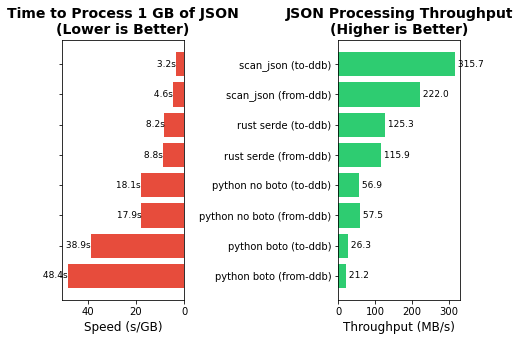

# Streaming JSON

Parse and transform JSON through a sliding window, without waiting for the complete document to load.

## Contents

- [`RJiter`](./rjiter/): streaming JSON parser for Rust
- [`scan_json`](./scan_json/): do actions while parsing JSON
- [`u8pool`](./u8pool/): pre-allocated stack for u8 slices
- [`examples`](./examples/)
- [`benchmarks`](./benchmarks/)

## Benchmark based on DynamoDB JSON format conversion

`scan_json` is the fastest, 12 times faster than the Python boto version.

